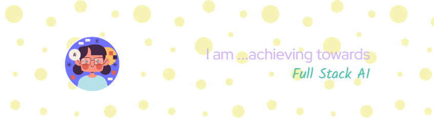

  

---

<!-- About Me Section -->

<h2>About Me</h2>

I’m a final-year <strong>Data Science student</strong> with a passion for exploring the world of <strong>Artificial Intelligence</strong> and its expanding ecosystem.  
Currently, I’m diving deep into various AI techniques — from machine learning to generative models — and constantly updating my projects as I learn and grow.  

Here are some of the major technologies and tools I’ve worked with:

<!-- Programming Languages -->
<h3>🖥️ Programming Languages</h3>

  
  
  <!-- Add more if needed -->

<!-- Libraries -->
<h3>📚Libraries

  
  
  
  

<!-- Tools -->
<h3>🛠️ Tools</h3>

  
  
  

<!-- Data visualization  -->
<h3>💹 visualization </h3>

  
  <!-- Add more if needed -->

---

### ⚙️ &nbsp;GitHub Analytics

  
  

  

---

  
### 📜 &nbsp;My Articles
  

---

### Connect with Me 🤝

  </h3>
  

  📝 <i>Credits: <a href="https://github.com/joyceDS22">Joyce</a></i> 
